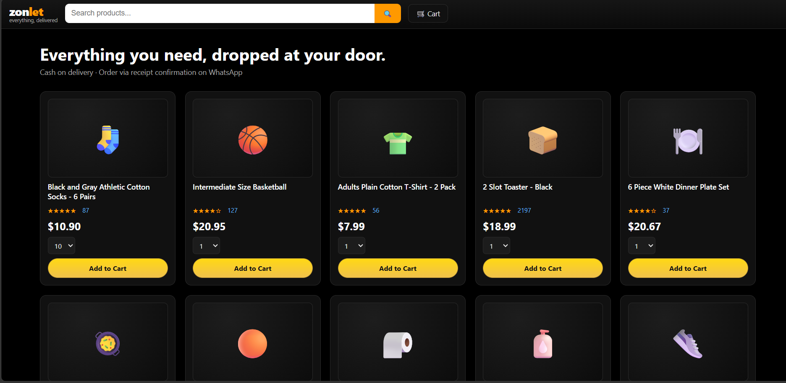
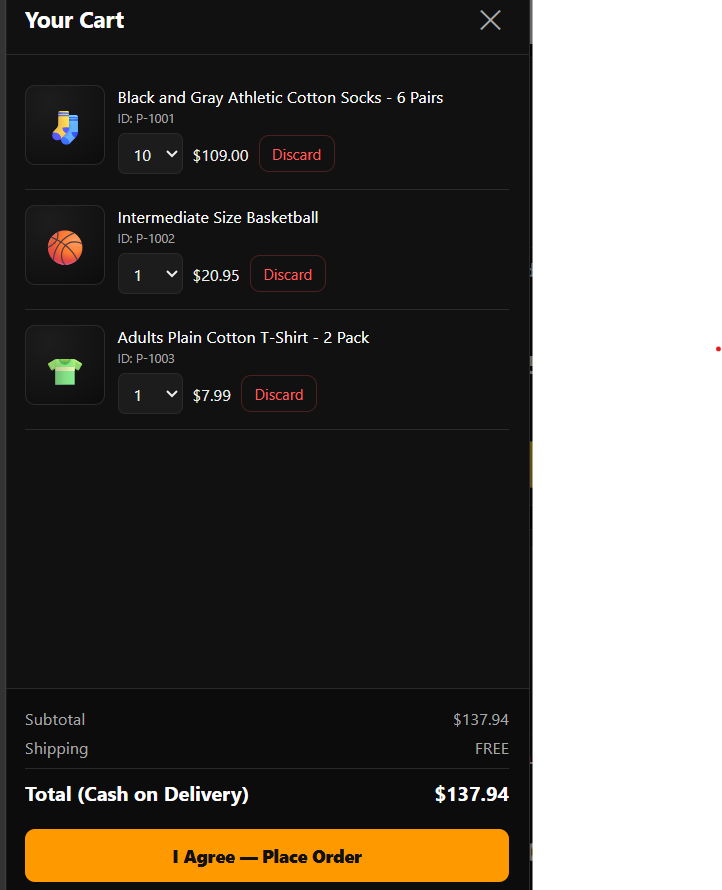
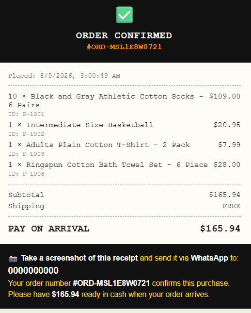
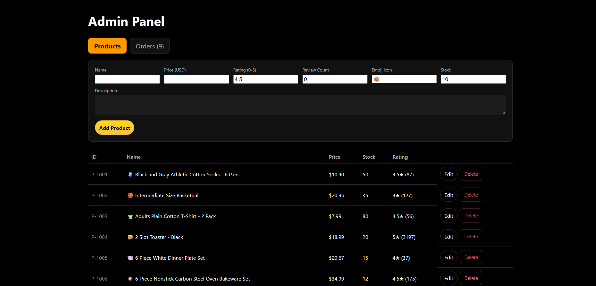
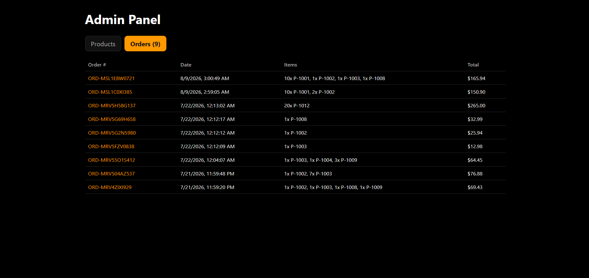

# Zonlet — React Shopping Site

A responsive, Amazon-style storefront built with **React + Vite**. Dark theme,
per-product cart with live totals, cash-on-delivery checkout that produces a
digital receipt, WhatsApp order confirmation, and a hidden admin panel for
managing products and viewing orders.

Built mobile-first — the layout, cart drawer, and receipt are all designed to
work comfortably on a phone.

---

## Screenshots

### Storefront & Cart

The **main page** is what a customer lands on. Products are laid out in a
responsive grid that reflows from six columns on desktop down to one or two on
a phone. Each card shows the product image, name, star rating, review count,
price, and a quantity selector. The header stays pinned to the top while
scrolling and holds the logo, a live search field, and the cart button with a
badge showing how many items are currently selected.

The **cart drawer** slides in from the left when the cart button is tapped. It
lists every selected product with its unique ID, lets the customer change the
quantity or discard an item outright, and recalculates the subtotal, shipping,
and final total live as they edit. Shipping is free above the threshold set in
the config; otherwise a flat rate applies. The total shown is the exact amount
they'll pay in cash on delivery.

<table>
  <tr>
    <td width="50%" valign="top">
      
      <p align="center"><em>Main page — product grid, search, sort, and cart</em></p>
    </td>
    <td width="50%" valign="top">
      
      <p align="center"><em>Your Cart — edit quantities, discard items, see the final total</em></p>
    </td>
  </tr>
</table>

### Order Confirmation Receipt

Once the customer taps **"I Agree — Place Order"**, the app generates a
**unique order number** and displays a clean digital receipt. The receipt lists
every item with its quantity, product ID, and line total, followed by the
subtotal, shipping, and the amount due on arrival.

Because this store runs on **cash on delivery**, the receipt doubles as the
order confirmation. The customer is asked to take a screenshot of it and send
it to the store's **WhatsApp** number — the messaging app most widely used in
our region — so the order can be confirmed and dispatched. A green **"Send
Order on WhatsApp"** button opens WhatsApp directly with the order number,
items, and total already typed into the message; the customer only needs to
attach their screenshot and hit send.

<p align="center">
  
</p>
<p align="center"><em>Order confirmation — unique order number, itemized receipt, and WhatsApp send button</em></p>

### Admin Panel — Products

The admin panel is **not linked anywhere on the storefront**. It's reached by
adding `#admin` to the site URL and entering the admin password. From the
Products tab, the store owner can add new products, edit any existing one, or
delete them. Every field is editable: name, price, rating, review count, icon,
stock level, and description. New products are automatically assigned a unique
ID, and changes appear on the storefront immediately.



*Admin panel — add, edit, and delete products*

### Admin Panel — Orders

The Orders tab is the store owner's record of every order placed through the
site. Each row shows the unique order number, the date and time it was placed,
the items and quantities ordered (by product ID), and the total amount due.
This is how an incoming WhatsApp receipt screenshot gets matched to a real
order — the customer sends the order number, and the owner looks it up here.



*Admin panel — full order history with unique order numbers*

---

## How to use the project

### 1. Install Node.js

Download and install [Node.js](https://nodejs.org) (version 18 or newer) if you
don't already have it. You can check whether it's installed by running:

```bash
node -v
```

### 2. Install the project dependencies

Open a terminal inside the project folder (the one containing `package.json`)
and run:

```bash
npm install
```

This downloads React, Vite, and everything else the project needs into a
`node_modules` folder. You only need to do this once.

### 3. Start the development server

```bash
npm run dev
```

Vite will print a local address, usually:

```
http://localhost:5173
```

Open that in your browser and the storefront loads. The dev server hot-reloads —
save any file and the browser updates instantly.

### 4. Open the admin panel

The admin panel has no link on the storefront by design. To reach it, add
`#admin` to the end of the URL:

```
http://localhost:5173/#admin
```

Enter the admin password (default: `admin123`) and you'll land on the Products
tab. To return to the storefront, remove `#admin` from the URL and reload.

### 5. Build for production

When you're ready to deploy:

```bash
npm run build
```

This produces an optimized `dist/` folder containing plain HTML, CSS, and JS.
You can upload that folder to any static host (Netlify, Vercel, GitHub Pages,
or ordinary shared hosting). To preview the built version locally first:

```bash
npm run preview
```

---

## Configuration

Everything you'll want to change lives in **`src/utils/helpers.js`**:

| Setting | What it does |
|---|---|
| `WHATSAPP_NUMBER` | The number customers send their receipt to |
| `ADMIN_PASSWORD` | Password for the `#admin` panel |
| `SHIPPING_FLAT` | Flat shipping cost applied below the free threshold |
| `FREE_SHIP_THRESHOLD` | Order subtotal above which shipping becomes free |

> **WhatsApp number format matters.** For the "Send Order on WhatsApp" button to
> work, the number must be in international format with **no `+`, no `00`, no
> spaces or dashes** — for example `"9647501234567"`, not `"+964 750 123 4567"`.
> The placeholder `"00000000"` is not a real routable number; replace it before
> testing.

To change the starting product catalog, edit
**`src/data/defaultProducts.js`**. (Note: once the app has run once, it loads
products from browser storage instead of this file — clear your browser's site
data to re-seed from the defaults.)

---

## Project structure

```
zonlet-shop/
├── index.html                    # HTML entry point
├── package.json                  # Dependencies and scripts
├── vite.config.js                # Build tool config
├── screenshots/                  # Images used in this README
└── src/
    ├── main.jsx                  # React entry point
    ├── App.jsx                   # Main logic: state, routing, cart, checkout
    ├── App.css
    ├── index.css                 # Design tokens + shared button/table styles
    ├── data/
    │   └── defaultProducts.js    # Seed product objects
    ├── utils/
    │   ├── storage.js            # localStorage persistence helpers
    │   └── helpers.js            # uid(), money(), config constants
    └── components/
        ├── Header.jsx / .css     # Logo, search, cart button
        ├── SortBar.jsx / .css    # Result count + sort dropdown
        ├── ProductGrid.jsx       # Renders the filtered/sorted grid
        ├── ProductCard.jsx / .css
        ├── CartDrawer.jsx / .css # Cart panel with live totals
        ├── ReceiptModal.jsx / .css
        └── AdminPanel.jsx / .css # Hidden product & order management
```

---

## How it works under the hood

**Products** are plain JavaScript objects, each with a unique `id` (e.g.
`P-1001`). That ID is the key everything hangs off — the cart references
products by ID, receipts print it, and the admin panel edits and deletes by it.

**Cart state** lives in `App.jsx` and is mirrored into `localStorage`, so a
customer's cart survives a page refresh. Totals are never stored — they're
recalculated on every render from current prices, so an admin price change is
reflected immediately.

**Checkout** generates a unique order number via `uid("ORD")`, which combines a
base-36 timestamp with a random suffix. The order snapshots the item names and
prices at the moment of purchase, so editing or deleting a product later never
alters an old receipt.

**Routing** is deliberately simple — no router library. `App.jsx` reads
`window.location.hash` and renders either the storefront or the admin panel,
listening for `hashchange` to stay in sync.

**Sorting** (Featured / Price / Rating) is computed with `useMemo` off a copy of
the product array, so it never reorders the underlying data or what the admin
sees.

---

## Current limitations

These are worth understanding before putting this in front of real customers:

**Data is stored in the browser, not on a server.** Products, orders, and carts
all live in `localStorage`. This means data is **per-browser and per-device** —
if you add a product from your laptop's admin panel, a customer opening the site
on their phone will not see it, because their browser has its own separate
storage. Likewise, orders customers place on their own devices will **not**
appear in your admin panel. Clearing browser data wipes everything.

This is fine for a prototype, a demo, or a single-device setup. For a real store
where inventory and orders are shared across everyone, you'll need a backend — a
database plus an API — replacing `src/utils/storage.js`.

**The admin password is not real security.** It's a plain string comparison in
client-side JavaScript, visible to anyone who opens their browser's developer
tools. It keeps casual visitors out; it will not stop anyone determined. Real
authentication requires a server.

**Checkout doesn't collect customer details.** There's no field for name, phone,
or delivery address — the flow relies on the customer sending their receipt over
WhatsApp, where you collect those details in conversation. Worth adding a proper
form if order volume grows.

**Stock doesn't decrease after an order.** Stock levels are set manually in the
admin panel and aren't reduced when a customer checks out.