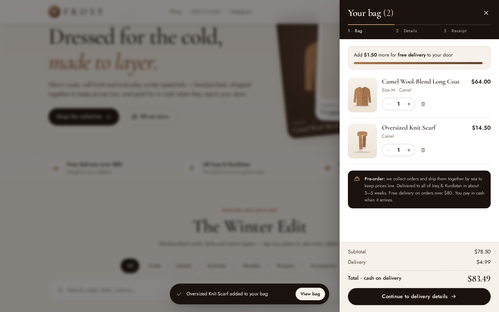
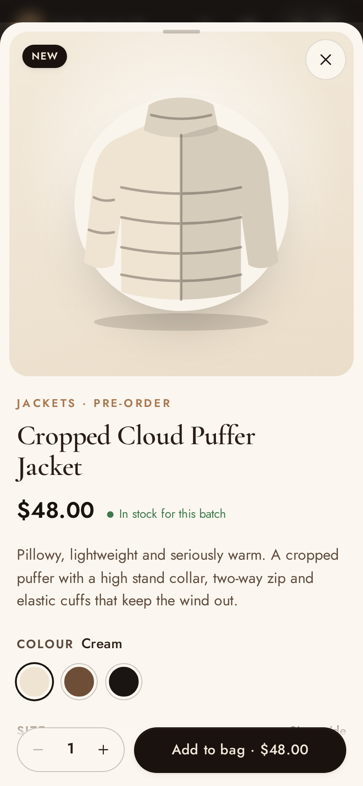
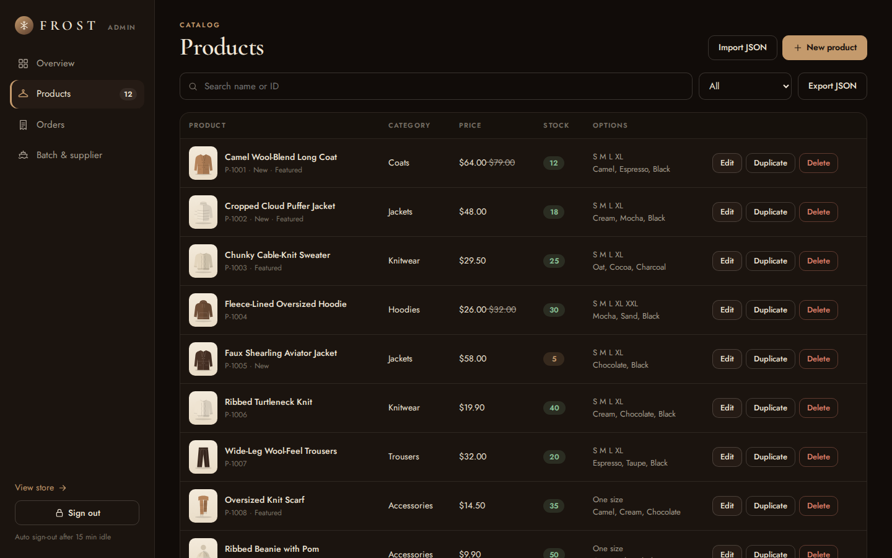
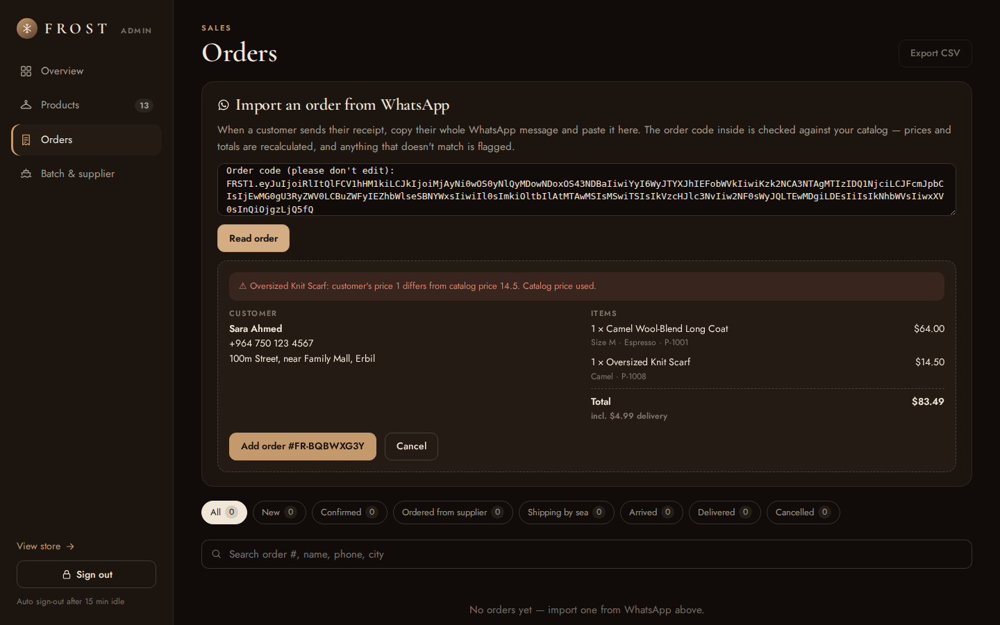

# Frost — Winter Clothing Shop

A boutique storefront for a small winter clothing business, built with **React + Vite**.
Warm brown, black and cream design; every product opens in a smooth, detailed
view; customers get a clear receipt to screenshot and send on **WhatsApp**; and a
secured admin panel helps you manage products, orders and your **sea-shipment
batches**.

**How the business works (and how the site supports it):**

1. You post pieces from your suppliers on the site and on Instagram.
2. A customer picks a size and colour, places an order and gets a **receipt with an order number**.
3. They **screenshot the receipt and send it to you on WhatsApp**. The message is pre-written for them.
4. You paste their WhatsApp message into **Admin → Orders → Import**. The order appears, checked against your prices.
5. When enough orders are confirmed, **Admin → Batch** gives you the combined supplier shopping list. You order everything together and ship it by sea to keep costs low.
6. The customer pays **cash on delivery**.

---

## Screenshots

<table>
  <tr>
    <td width="50%" valign="top"><p align="center"><em>Home: layered hero, pre-order info</em></p></td>
    <td width="50%" valign="top"><p align="center"><em>The Winter Edit: categories, search, sort</em></p></td>
  </tr>
  <tr>
    <td width="50%" valign="top"><p align="center"><em>Product view zooms out of the card: colours, sizes, size guide</em></p></td>
    <td width="50%" valign="top"><p align="center"><em>Bag: free-delivery progress, pre-order note, totals</em></p></td>
  </tr>
  <tr>
    <td width="50%" valign="top" align="center"><p align="center"><em>Receipt, sized to fit one phone screenshot</em></p></td>
    <td width="50%" valign="top" align="center"><p align="center"><em>On phones, products slide up as a sheet</em></p></td>
  </tr>
  <tr>
    <td width="50%" valign="top"><p align="center"><em>Admin dashboard and store-health checks</em></p></td>
    <td width="50%" valign="top"><p align="center"><em>Products: add, edit, duplicate, export</em></p></td>
  </tr>
  <tr>
    <td width="50%" valign="top"><p align="center"><em>Import an order straight from the WhatsApp message</em></p></td>
    <td width="50%" valign="top"><p align="center"><em>Batch progress and the supplier shopping list</em></p></td>
  </tr>
</table>

---

## Getting started

You need [Node.js](https://nodejs.org) **20.19 or newer**.

```bash
npm install                 # once
npm run set-admin-password  # once: choose your admin password
npm run dev                 # start the site at http://localhost:5173
```

- **Store:** http://localhost:5173
- **Admin:** http://localhost:5173/#admin (not linked anywhere on the store)

### Before you go live, edit `src/config.js`

| Setting | What it does |
|---|---|
| `whatsappNumber` | Your WhatsApp number, **digits only in international format**, e.g. `"9647501234567"` (no `+`, `00` or spaces). Until it's set, the receipt shows a warning instead of the WhatsApp button. |
| `instagram` | Your Instagram handle without `@` (or `""` to hide it) |
| `currency` | Currency code and locale for prices |
| `shippingFlat` / `freeShippingThreshold` | Delivery charge, and the subtotal above which delivery is free |
| `deliveryEstimate` | Shown everywhere, e.g. `"3–5 weeks"` |
| `batchTarget` | How many confirmed orders you want before placing a supplier order |

### Admin password

There is **no default password**. Run `npm run set-admin-password` and choose one
(at least 12 characters; a short sentence works well). The script stores only a
salted **hash** in `.env.local`, which git ignores. Restart `npm run dev` after
changing it.

When you deploy, add the same line (printed by the script) to your host's
**environment variables**:

```
VITE_ADMIN_PASSWORD_HASH=pbkdf2-sha256:600000:....
```

---

## Managing products

1. Open **Admin → Products** and add or edit items. Changes show immediately on
   *your* device, with a "preview" banner.
2. To publish them to everyone, click **Download products.json**, replace
   `src/data/products.json` in the project with it, and redeploy.

**Photos:** use `https://` image links, or put photo files in `public/products/`
and write `/products/your-photo.jpg`. Products without photos show a styled
illustration that changes colour with the selected colour.

## Managing orders

- **Import:** copy the customer's whole WhatsApp message and paste it into
  **Admin → Orders → Import from WhatsApp**. The order code in the message is
  checked against your catalog. Prices and totals are recalculated, and anything
  that doesn't match (for example, an edited price) is flagged in red.
- **Statuses:** New → Confirmed → Ordered from supplier → Shipping by sea →
  Arrived → Delivered (or Cancelled).
- **Batch:** the **Batch & supplier** tab adds up every *Confirmed* order into
  one shopping list (product, size, colour, quantity), which you can export as CSV.
  Buttons move whole groups of orders through the shipping stages.
- Export all orders as CSV any time.

> Orders and product drafts are saved in the browser you use for admin
> (localStorage). Use the same browser and device for admin, and export CSV and
> JSON regularly as backups.

---

## Build & deploy

```bash
npm run build     # creates dist/
npm run preview   # test the production build locally
npm test          # run the security/validation checks
npm audit         # check dependencies for known vulnerabilities
```

Upload `dist/` to any static host. Security headers are already configured
for **Netlify / Cloudflare Pages** (`public/_headers`) and **Vercel**
(`vercel.json`). Always serve the site over **HTTPS**.

---

## Security

The site was hardened with the **OWASP Top 10** and OWASP cheat sheets in mind:

| Area | What's in place |
|---|---|
| **A02 Cryptographic failures** | Admin password stored only as a salted **PBKDF2-SHA256 hash (600,000 iterations)**, checked with the Web Crypto API and a constant-time comparison. Order numbers use `crypto.getRandomValues`, so they can't be guessed. HSTS header forces HTTPS. |
| **A03 Injection / XSS** | React escapes all output, and the code never uses `dangerouslySetInnerHTML`. Every input (checkout form, admin form, imported files, pasted WhatsApp codes, anything read back from browser storage) is validated and length-limited. Control, zero-width and bidi-override characters are stripped. Image links must be `https://` or site paths, so `javascript:`, `data:` and `http:` are blocked. Colours must be strict hex. **Strict Content-Security-Policy**: scripts, styles and fonts only from this site, `object-src 'none'`, `base-uri 'self'`. |
| **A04 Insecure design** | Imported orders are **re-priced from your catalog**, and mismatches are flagged, so a customer can't change a price in the WhatsApp message. Quantities are capped by stock. |
| **A05 Security misconfiguration** | Security headers: CSP, `X-Frame-Options: DENY` + `frame-ancestors 'none'` (no clickjacking), `nosniff`, strict `Referrer-Policy`, `Permissions-Policy` (camera, mic, location and payment off), COOP/CORP. No source maps in production. Admin page is `noindex`. |
| **A06 Vulnerable components** | Upgraded to Vite 8 (fixes the esbuild/Vite dev-server advisories). `npm audit` reports **0 vulnerabilities**. Fonts are self-hosted, with no third-party CDN. |
| **A07 Authentication failures** | No default password; minimum length and common-word checks when setting it; **lockout after 5 failed attempts** (5 min, doubling up to 1 h); **automatic sign-out after 15 minutes idle**; sign-out button; password never kept after a login attempt. |
| **A08 Data integrity** | Stored data is schema-validated on every load; the admin panel is code-split so its code only downloads on `#admin`. |
| **Other** | External links use `rel="noopener noreferrer"`. Product images load with `referrerPolicy="no-referrer"`. CSV exports are protected against **CSV/formula injection**. Imported JSON is limited to 1 MB. |

**Please know this limit:** Frost is a *static* site with no server. The admin
panel only changes data in **your own browser**, and a static site can't hide
anything from someone who downloads its files. The password hash is in the
admin code, so choose a **long, unique password**. The admin panel can't be used
to change what other visitors see: publishing products always goes through
`products.json` and a redeploy, which is protected by your hosting and Git
accounts. Turn on two-factor authentication for both. If you later want online
payments or customer accounts, add a real backend first.

---

## Project structure

```
├── index.html
├── vite.config.js            # build config + Content-Security-Policy
├── vercel.json               # security headers (Vercel)
├── public/
│   ├── _headers              # security headers (Netlify / Cloudflare Pages)
│   ├── favicon.svg
│   └── products/             # put product photos here
├── scripts/
│   └── set-admin-password.mjs
├── tests/
│   └── security.test.mjs     # npm test
└── src/
    ├── config.js             # ← your store settings
    ├── App.jsx               # routing (store / #admin)
    ├── Storefront.jsx        # cart, filters, checkout
    ├── data/products.json    # ← your published catalog
    ├── hooks/useDialog.js    # accessible, animated modals
    ├── utils/                # validation, auth, storage, order codes
    ├── components/           # Header, Hero, ProductModal, CartDrawer, ReceiptModal…
    └── admin/                # AdminPanel, Login, Products, Orders, Batch
```
