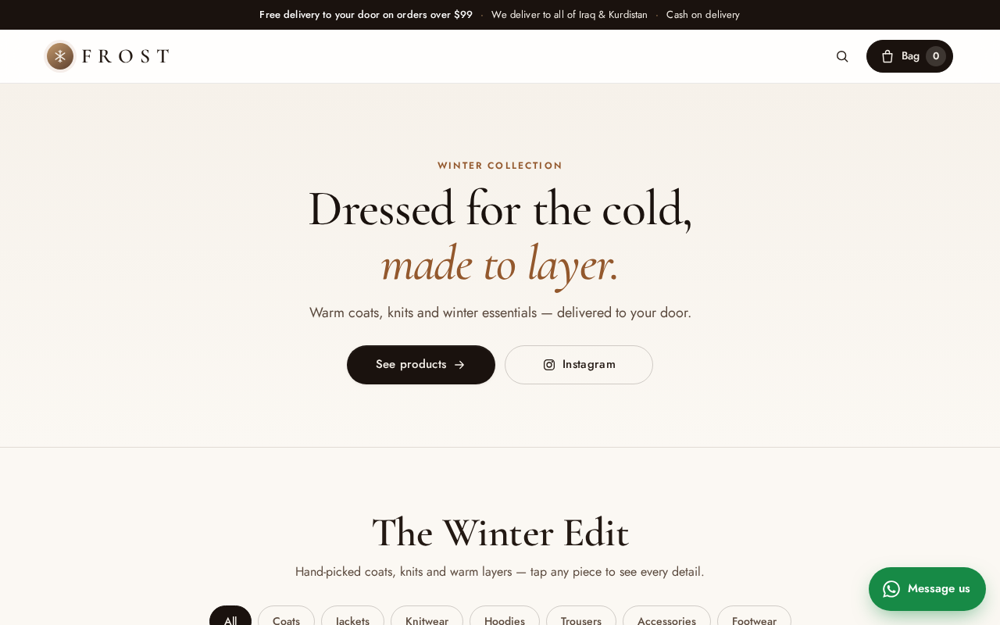
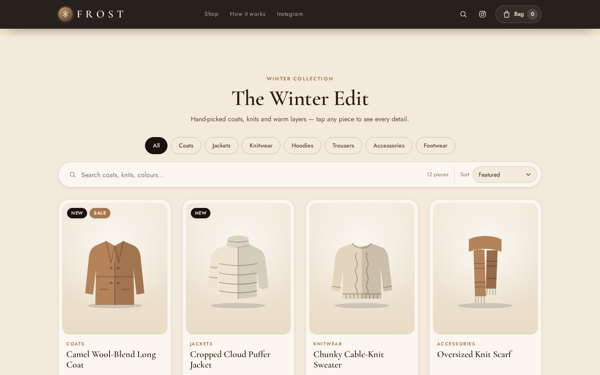
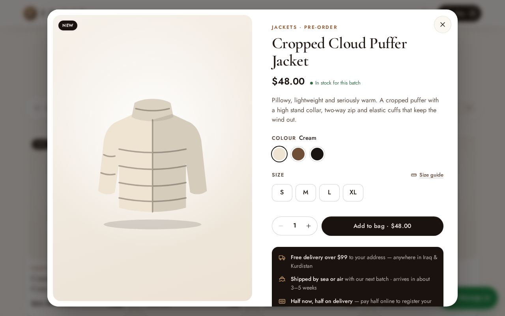
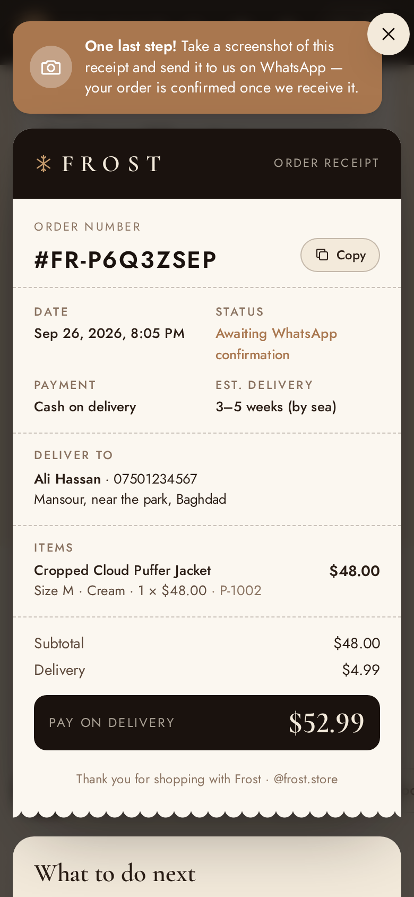
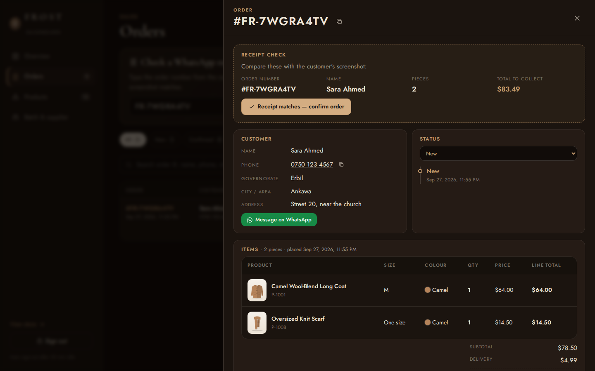
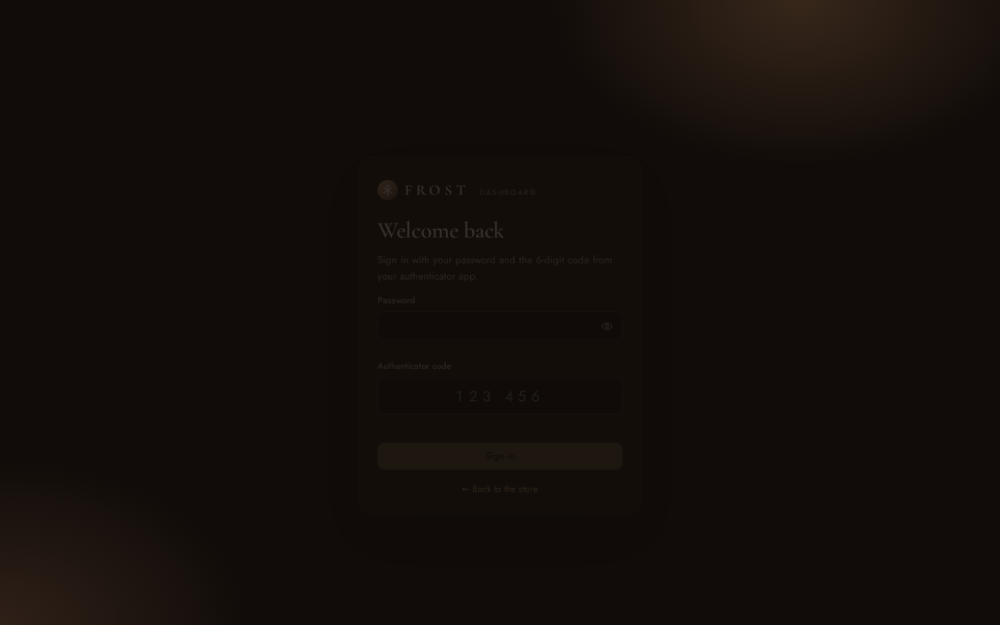
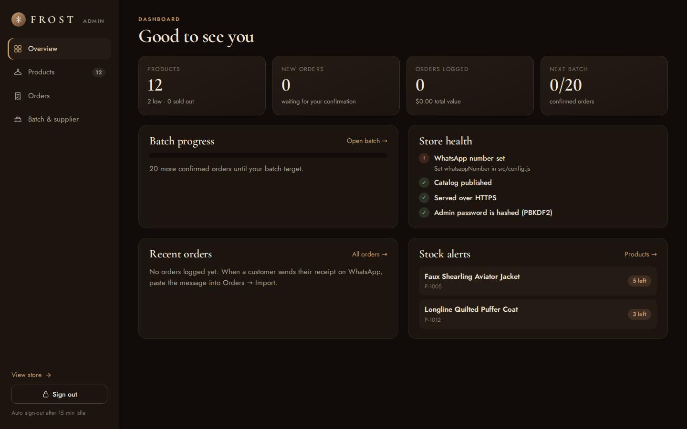
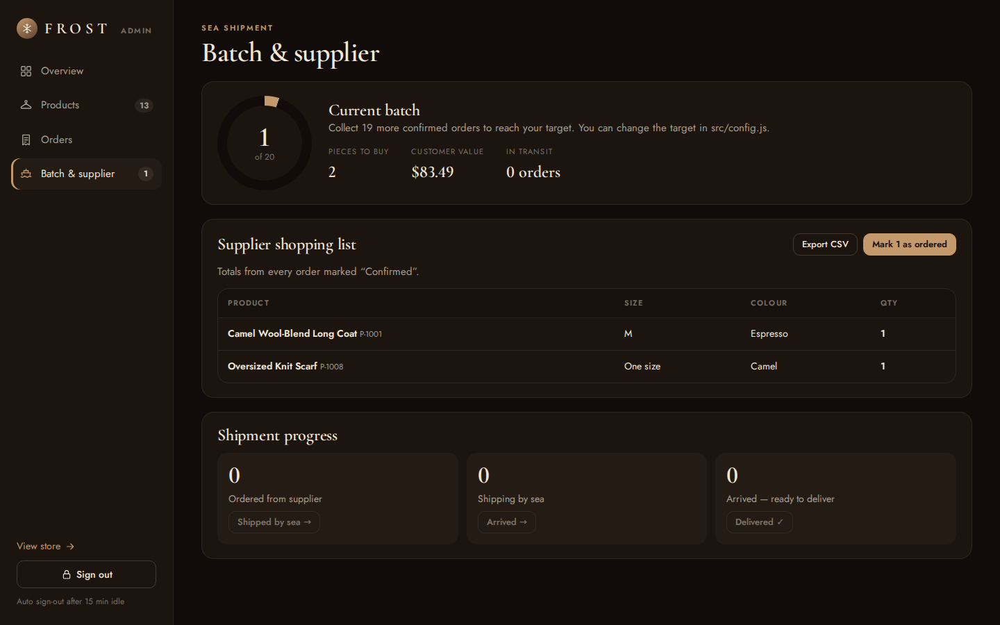

# Frost — Winter Clothing Shop

> A complete online shop for a small winter-clothing business in Iraq & Kurdistan:
> a fast, mobile-first storefront, WhatsApp order confirmation, and a private,
> two-factor-protected dashboard. React + Node.js/Express + SQLite.

**Going live at frostshop.store?** Follow [DEPLOY.md](DEPLOY.md).

## About

Frost is built for a business that **pre-orders winter clothing from Chinese
suppliers, batches the orders, and ships them together** (by sea or air) to keep
prices low. There is no online card checkout. Customers place an order, **pay half
online to register it and the other half on delivery**, and confirm by sending a
**screenshot of their receipt on WhatsApp**. The owner checks that receipt
against the real order in a secure dashboard and confirms it.

### Features

**For customers**
- Clean brown / black / cream storefront that works well on phones, with search, categories and sorting
- Product view with a **1–5 photo slider** (auto-advances every 5 seconds), colours, sizes, size guide and delivery info
- Bag and checkout with every governorate of Iraq & Kurdistan
- **Free delivery over $99** and delivery to all of Iraq & Kurdistan
- A compact **receipt that fits one phone screenshot**, with the owner's WhatsApp number, a one-tap "Send on WhatsApp" message and a working copy button
- Floating WhatsApp button on every page
- Receipts are saved on the device and can be reopened later

**For the owner (private dashboard at `/#dabo`)**
- Sign-in with a strong password **plus an authenticator-app code**
- Every order with full customer, address, item, size, colour and price detail, plus a "check a WhatsApp receipt" lookup
- Order statuses from New to Delivered, search, CSV export
- Products: add, edit, duplicate, delete, upload 1–5 photos from a phone or computer, with JSON backup/import
- Batch & supplier view: one combined shopping list of all confirmed orders
- Activity log of sign-ins and changes

**Security** (checked against the OWASP Top 10, with automated tests): scrypt passwords, TOTP 2FA, httpOnly session cookies, rate limiting, strict CSP, server-side price and stock checks, upload validation, and no secrets in the website or in git. Details [below](#security).

### Tech stack

| Part | Technology |
|---|---|
| Website | React 18, Vite, plain CSS, self-hosted fonts |
| Server | Node.js 20+, Express 5 |
| Database | SQLite (`better-sqlite3`, WAL mode), one file |
| Security | Helmet, express-rate-limit, JWT sessions, scrypt, TOTP (RFC 6238) |
| Tests | Node's built-in test runner (`npm test`) |
| Hosting | One Node app (serves site + API). Railway or a small VPS with Caddy. |

---

## How the business flow works

1. A customer picks pieces, chooses their **governorate**, city and address, and places the order.
2. The **server** checks stock, sets the real prices and saves the order. The customer gets a receipt with a unique order number.
3. They **screenshot the receipt and send it to you on WhatsApp**. The message is pre-written.
4. In your dashboard, go to **Orders → Check a WhatsApp receipt** and type the order number from the screenshot.
   You see the real order — customer, phone, full address, every item with size, colour and price, and the total — so you can confirm the screenshot matches.
   Then click **"Receipt matches — confirm order"**.
5. **Batch & supplier** adds up all confirmed orders into one shopping list for your supplier. You order everything together and ship it by sea or air.
6. You deliver and collect the other half.

---

## Screenshots

<table>
  <tr>
    <td width="50%" valign="top"><p align="center"><em>Home: delivery promises up front, two simple buttons</em></p></td>
    <td width="50%" valign="top"><p align="center"><em>Clean, light product grid</em></p></td>
  </tr>
  <tr>
    <td width="50%" valign="top"><p align="center"><em>Product view: colours, sizes, size guide, delivery info</em></p></td>
    <td width="50%" valign="top"><p align="center"><em>Receipt: fits one phone screenshot, half now / half on delivery</em></p></td>
  </tr>
  <tr>
    <td width="50%" valign="top"><p align="center"><em>Dashboard: full order detail to check a receipt</em></p></td>
    <td width="50%" valign="top"><p align="center"><em>Sign-in with password + authenticator code</em></p></td>
  </tr>
  <tr>
    <td width="50%" valign="top"><p align="center"><em>Overview, security checks and activity log</em></p></td>
    <td width="50%" valign="top"><p align="center"><em>Batch progress and supplier shopping list</em></p></td>
  </tr>
</table>

---

## Getting started

You need [Node.js](https://nodejs.org) **20.19 or newer**.

```bash
npm install          # once
npm run setup-admin  # once: set your dashboard password + authenticator app
npm run dev          # starts the website AND the API together
```

- **Shop:** http://localhost:5173
- **Dashboard:** http://localhost:5173/#dabo — the address is secret and not linked anywhere. `#admin` does nothing.

### Setting up your dashboard sign-in (`npm run setup-admin`)

1. Choose a password (at least 12 characters; a short sentence works well).
2. A **QR code** appears in the terminal. Scan it with **Google Authenticator**, **Microsoft Authenticator** or **Authy** on your phone.
3. Type the 6-digit code the app shows to confirm.

Every sign-in then needs your **password + the current 6-digit code** from your phone.
Someone who learns your password still can't get in without your phone.

The script saves your settings to `server/.env`. This file stores only a hash of
your password, never the password itself, and git ignores it.

### Store settings — `shared/store.js`

| Setting | What it does |
|---|---|
| `whatsappNumber` | Your WhatsApp number, **digits only in international format** (set to `9647509225927`) |
| `whatsappDisplay` | How the number is shown to customers (`0750 922 5927`) |
| `instagram` | Your Instagram handle without `@` |
| `shippingFlat` / `freeShippingThreshold` | Delivery charge, and the order amount from which delivery is free (**99**) |
| `depositPercent` | Share of the total paid online to register the order (**50**). The rest is paid on delivery. |
| `deliveryArea` | Shown to customers ("all of Iraq & Kurdistan") |
| `deliveryEstimate` | e.g. `"3–5 weeks"` |
| `batchTarget` | How many confirmed orders you want before placing a supplier order |

The list of governorates customers can choose from is `GOVERNORATES` in the same file.

---

## The dashboard (`#dabo`)

- **Overview:** new orders, money to collect, batch progress, stock alerts, security checks and an **activity log** of sign-ins (including failed attempts) and changes.
- **Orders:** every order appears the moment a customer places it. You can:
  - **Check a WhatsApp receipt** by order number. If the number doesn't exist, the screenshot is fake or edited.
  - Open **full details**: customer name, phone (tap to call or WhatsApp), governorate, city, address, note, every item with product ID, size, colour, quantity and price, the total to collect, the status timeline, a private note, and the customer's other orders.
  - Change status (New → Confirmed → Ordered from supplier → Shipping (sea or air) → Arrived → Delivered, or Cancelled). Cancelling puts the items back in stock.
  - Search by order number, name, phone, city or address, and export CSV.
- **Products:** add, edit, duplicate and delete. Changes are **live on the shop immediately**. You can also back up or import the catalog as JSON.
- **Photos:** each product can have **1 to 5 photos**. In the product editor, tap **Upload photos** and pick them from your phone or computer. They're shrunk automatically before upload, so large phone photos are fine. Use the ← → buttons to reorder: the first photo is the main one shown on the product card. You can also paste an `https://` photo link instead. Uploaded photos are saved in `data/uploads/`, next to the database, so back up the whole `data/` folder.
- **Batch & supplier:** a combined shopping list of all confirmed orders, and buttons to move orders through the shipping stages.

---

## API

| Method | Path | Who | What |
|---|---|---|---|
| GET | `/api/products` | public | Catalog |
| GET | `/api/products/:id` | public | One product |
| POST | `/api/orders` | public | Place an order (server sets prices and checks stock) |
| GET | `/api/orders/:orderNumber` | customer | Their receipt, needs the secret `X-Order-Token` from checkout |
| POST | `/api/admin/login` | — | Password + 6-digit code → session cookie |
| GET | `/api/admin/me` · POST `/logout` · `/logout-all` | admin | Session |
| GET/POST/PUT/DELETE | `/api/admin/products[/:id]` | admin | Manage products |
| GET | `/api/admin/orders?status=&q=` | admin | List and search orders |
| GET/PATCH/DELETE | `/api/admin/orders/:orderNumber` | admin | Full detail, update status/note, delete |
| GET | `/api/admin/audit` | admin | Activity log |

Errors are always JSON: `{ "error": "message", "fields": { … } }`.

---

## Deploying

**Step-by-step guide for going live at frostshop.store: see [DEPLOY.md](DEPLOY.md)**
(hosting, domain, DNS, backups, updates).

The site and API run as **one Node.js app** (the server also serves the built
website). Use a host that runs Node and gives you a **persistent disk** for the
database, e.g. Render, Railway, Fly.io or a small VPS.

```bash
npm install
npm run build        # builds the website into dist/
npm start            # serves website + API on $PORT (default 4000)
```

Set these environment variables on your host. The first three come from your `server/.env`:

| Variable | Value |
|---|---|
| `ADMIN_PASSWORD_HASH` | from `server/.env` |
| `ADMIN_TOTP_SECRET` | from `server/.env` |
| `JWT_SECRET` | from `server/.env` (required in production) |
| `DB_PATH` | a file on the persistent disk, e.g. `/data/frost.db` |
| `UPLOADS_DIR` | a folder on the same disk for product photos, e.g. `/data/uploads` |
| `TRUST_PROXY` | `1` (default in production). Set `0` only if nothing sits in front of the server. |

`npm start` always runs in production mode, so `NODE_ENV` and `PORT` need no setting on most hosts.

Always use **HTTPS**. The database is a single file; run `npm run backup` regularly. It copies the database and photos into `backups/`.

---

## Security

Built and checked against the **OWASP Top 10** and OWASP cheat sheets. Run the
30 automated security and API tests with `npm test`.

| Area | What's in place |
|---|---|
| **Authentication (A07)** | Password hashed with **scrypt** plus **two-factor codes** (TOTP, RFC 6238), and each code works only once. Constant-time checks. No default password. **Account lock** after 10 failed sign-ins (15 min). Every sign-in and failure is logged. |
| **Sessions** | Signed **JWT** (HS256, algorithm pinned, issuer/audience checked) in an **httpOnly, SameSite=Strict** cookie scoped to `/api/admin`, so JavaScript can't read it. Each JWT is tied to a server-side session, so **sign-out really revokes it**, including "sign out on every device". 30-minute idle timeout and 8-hour maximum. |
| **Hidden dashboard** | Moved from `#admin` to `#dabo`, not linked anywhere, and `noindex`. This is only a first layer: every admin API call is blocked without a valid signed-in session. |
| **Rate limiting** | Sign-in: 5 failed attempts per 15 min per IP. Orders: 10 per hour per IP. Receipt lookups: 60 per 15 min. Admin API: 120 per minute. Whole API: 300 per 15 min. |
| **Injection & XSS (A03)** | Every input is validated on the server with the same shared rules as the website (types, lengths, allowed values, governorate list). All SQL uses **bound parameters**. React escapes all output. Strict **Content-Security-Policy**: scripts, styles and fonts only from this site; no inline scripts, no framing. |
| **IDOR (A01)** | Knowing an order number is not enough to see an order. Customers need the secret receipt token given at checkout, and every other case returns the same "not found". Admin routes validate IDs and require a session. |
| **Photo uploads** | Only for signed-in admins. The real file type is checked from the file's bytes (JPEG, PNG or WebP only, never SVG or HTML). Max 5 MB. Files get random names chosen by the server and are served with `nosniff` and a locked-down Content-Security-Policy. |
| **SSRF** | The server **never fetches URLs** supplied by users. Product photo links must be `https://` or a site path; `javascript:`, `data:`, `file:`, `http:`, internal addresses and `//` tricks are rejected. |
| **Price tampering (A04)** | The browser only sends product IDs, sizes, colours and quantities. The server looks up prices, computes totals and checks stock inside a database transaction (no overselling). |
| **CSRF** | SameSite=Strict cookie, a required custom request header, and an Origin check. Cross-site preflights are refused, and only JSON bodies are accepted. |
| **Headers (A05)** | Helmet: CSP, HSTS (production), `X-Frame-Options: DENY`, `nosniff`, strict Referrer-Policy, COOP/CORP and Permissions-Policy. No `X-Powered-By`, no stack traces in responses, 20 KB body limit. |
| **Other** | Mass-assignment protection (whitelisted fields only), parameter and prototype pollution tests, a hidden anti-bot form field, `no-store` on personal data, CSV-injection-safe exports, crypto-random order numbers, `npm audit` reporting **0 vulnerabilities**. |

---

## Project structure

```
├── shared/                  # used by BOTH website and server
│   ├── store.js             # ← store settings, governorates
│   ├── validate.js          # all validation rules
│   └── pricing.js           # totals & free-delivery rule
├── server/
│   ├── index.js             # starts the server
│   ├── app.js               # Express app: security middleware + routes
│   ├── config.js            # environment variables
│   ├── db.js                # SQLite schema (seeded from src/data/products.json)
│   ├── routes/              # public.js, admin.js
│   ├── repos/               # products.js, orders.js (data access)
│   ├── security/            # auth (JWT sessions), password, totp, rate limits, CSRF
│   └── scripts/setup-admin.js
├── src/                     # React website
│   ├── api.js               # API client
│   ├── Storefront.jsx       # shop, bag, checkout
│   ├── components/          # Header, Hero, ProductModal, CartDrawer, ReceiptModal…
│   └── admin/               # dashboard (#dabo), incl. PhotoManager (photo upload)
├── tests/                   # npm test
├── scripts/
│   ├── dev.mjs              # npm run dev (site + API together)
│   ├── start.mjs            # npm start (production)
│   └── backup.mjs           # npm run backup (database + photos)
├── deploy/                  # Caddyfile + systemd service for a VPS
├── railway.json             # Railway build/start settings
├── DEPLOY.md                # step-by-step: hosting, domain, DNS
└── public/products/         # product photos you ship with the site
```
